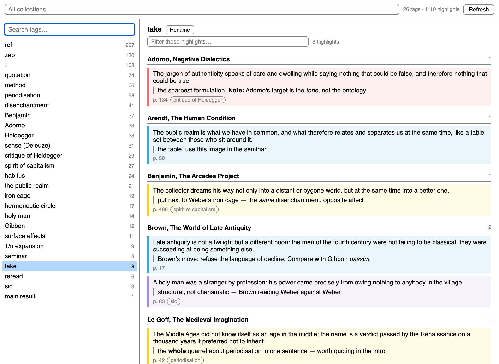
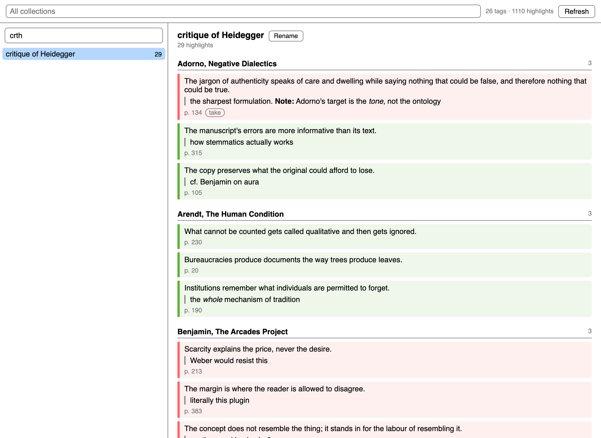
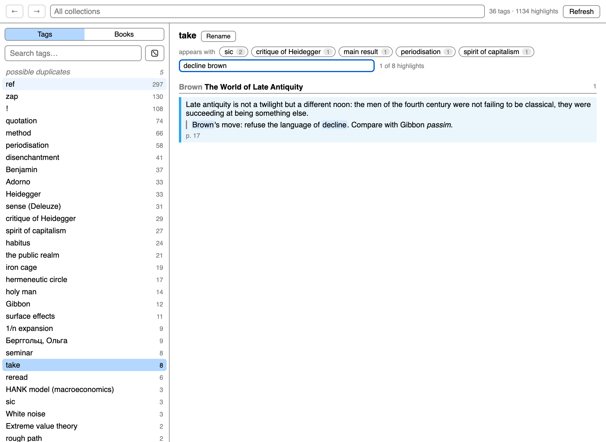
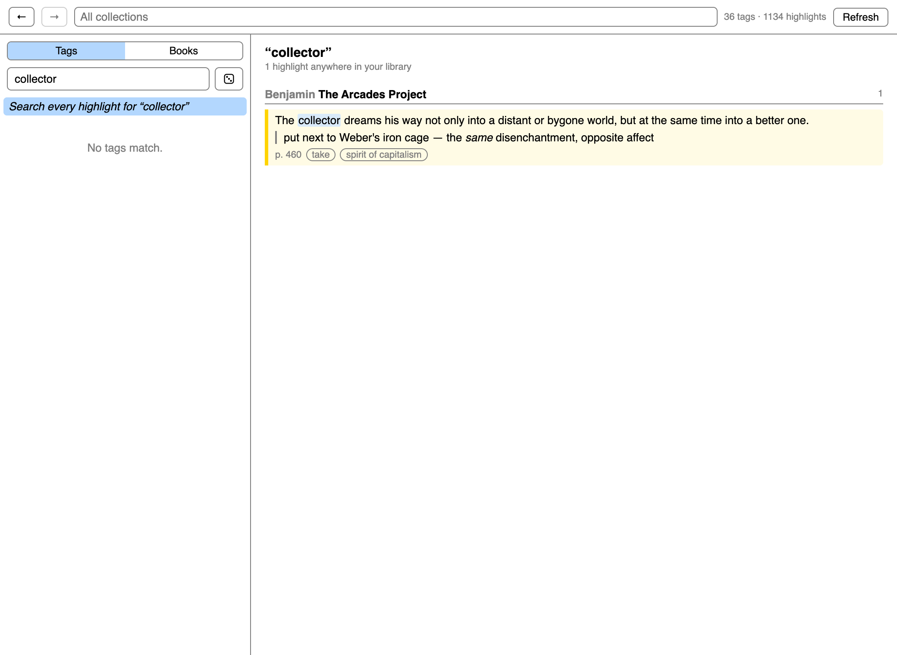
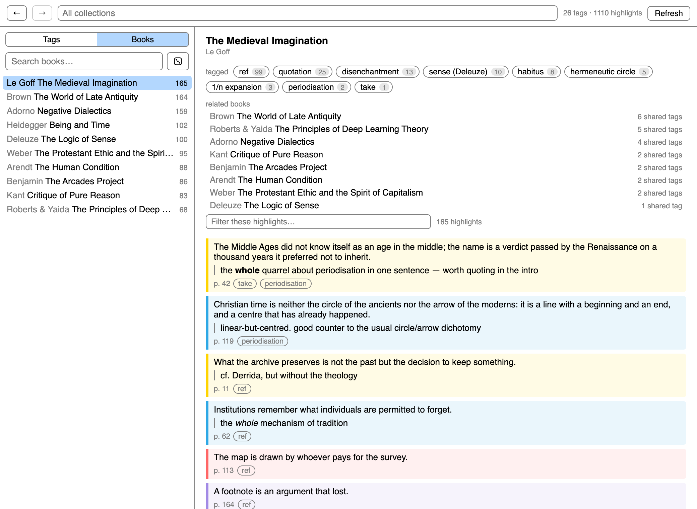
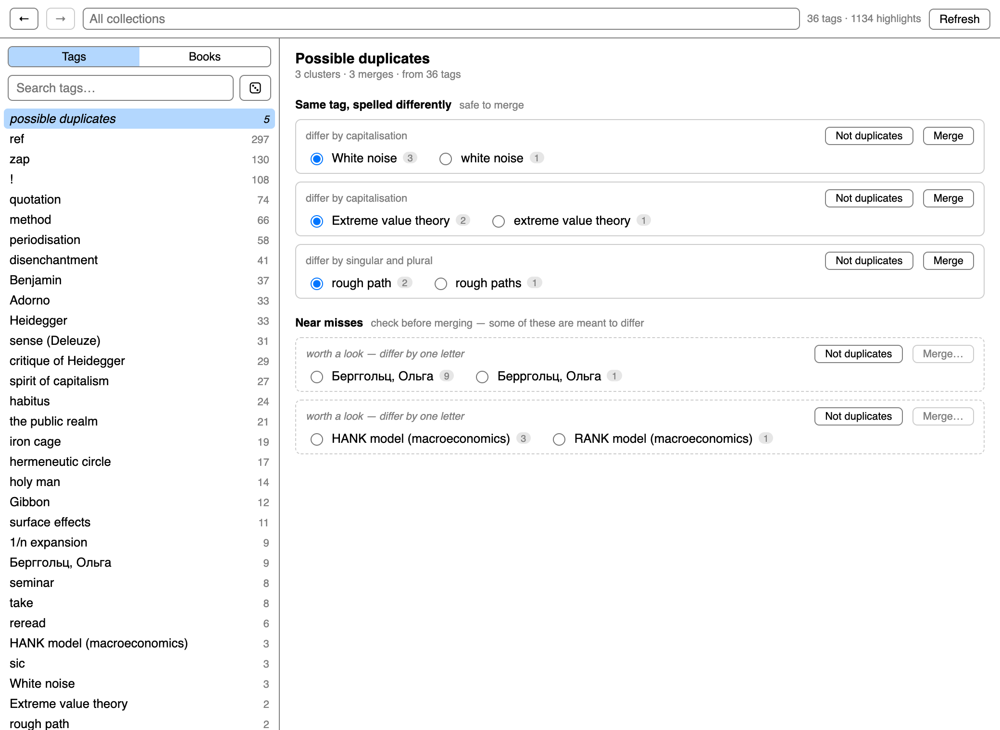
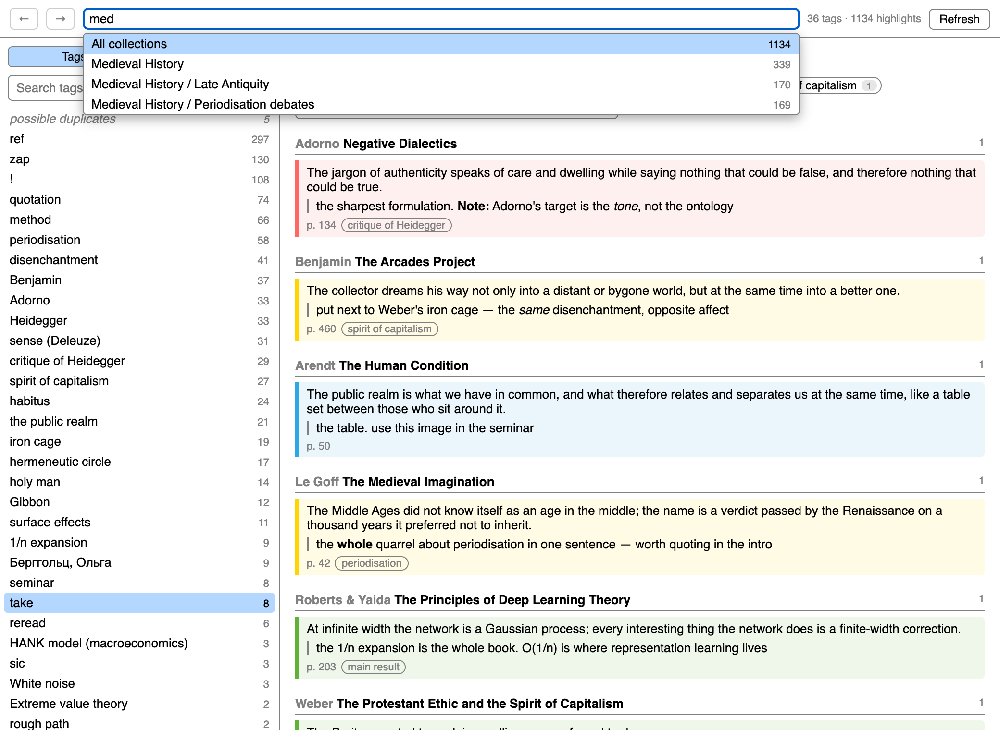
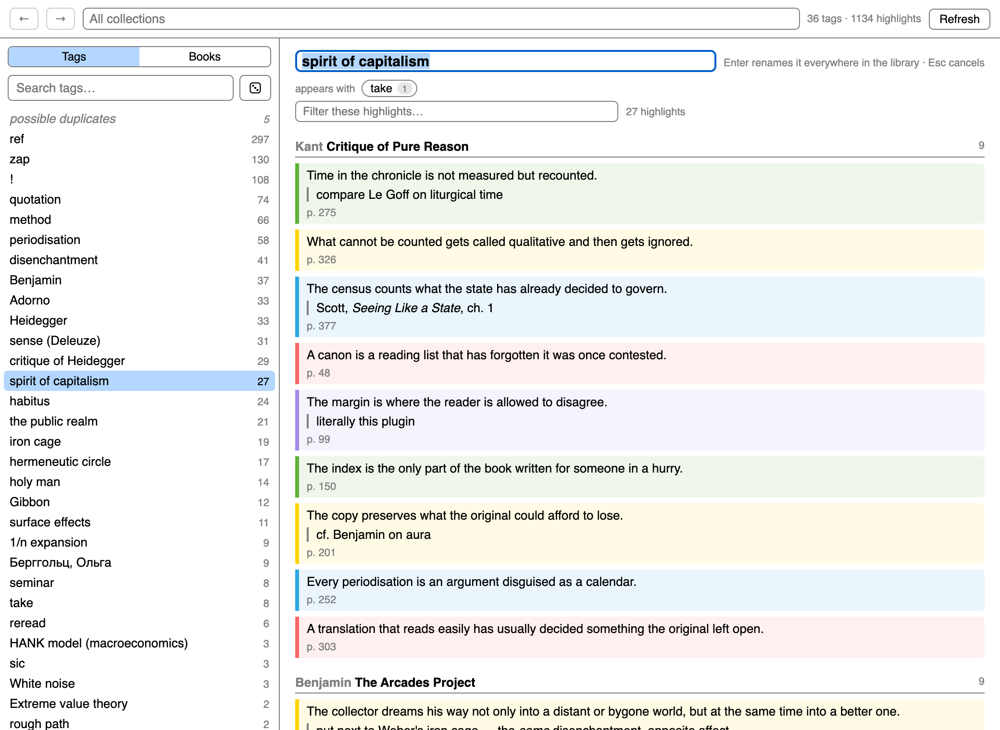
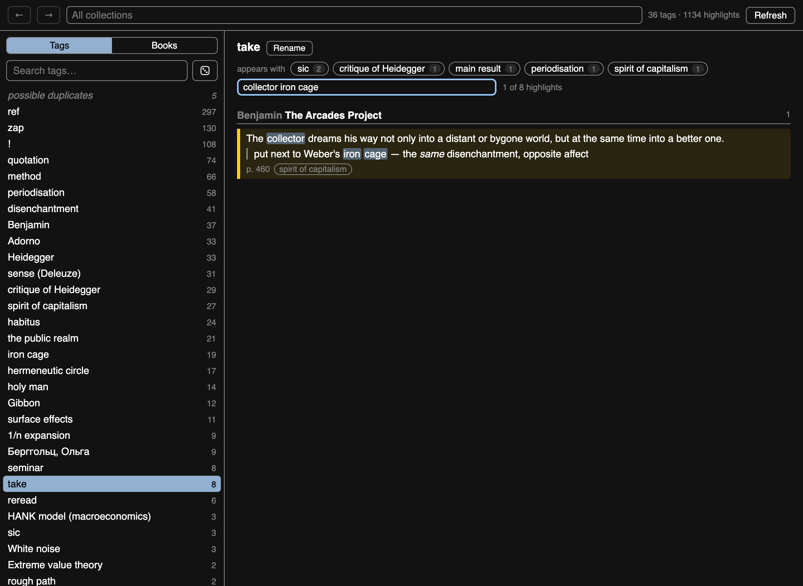

# Tag Explorer

A Zotero 10 plugin for reading your own marginalia by tag.

**Tools → Tag Explorer…** opens a window with two ways in — **Tags** and
**Books** — sharing one reading pane:

- every tag you have put on a highlight, most used first, with a fuzzy search
  box: your letters have to appear in the tag in order, but need not be
  adjacent, so `mdvl` finds `medieval` and `хдг` finds `Хайдеггер`. Matching
  is literal and case-insensitive. Exact matches sort above prefixes above
  substrings above scattered ones;
- the highlights carrying the selected tag on the right, grouped by book, in
  reading order, in their own highlight colour, with your comments — rendering
  the four formats Zotero itself writes, `<i>` `<b>` `` ``. Only
  those, in pairs: a highlight reading `< H ≤ 1` is maths, not markup, and
  stays as it is;
- a filter over the highlights of the selected tag — every word you type has to
  appear somewhere in the highlight, your comment or the book, in any order, so
  `decline brown` and `brown decline` both find the same one. Matches are
  marked in place, so you can see *why* something survived the filter instead of
  hunting for the word. `Esc` clears it; it resets whenever you pick a different
  tag;
- a collection box at the top to restrict everything to one project —
  fuzzy-searchable over the full path (`phil frank` finds *Philosophy /
  Frankfurt School*), showing how many highlights each holds,
  sub-collections included;
- **search every highlight**, not just one tag's — type in the tag box and take
  the pinned row at the top of the list. The escape hatch for when you cannot
  remember which tag you filed something under, and each result carries its own
  tags, so a hit is also a way back into the tag axis, and the words you searched
  for are marked in every result;
- **`←` `→`** (or `Alt`+arrows) walk back and forward through where you have
  been — tags, searches and collection scopes alike;
- **Rename** edits the tag in place and calls Zotero's own rename, so it moves every item
  in the library that carries it — not just these highlights, and not just the
  collection in scope — keeps the tag's colour and syncs. If the name you type is
  already in use, Zotero would silently merge the two, so the plugin stops and
  says how many items the other tag is on; merging then takes a second,
  deliberate click;
- a **Books** axis: every book you have marked, most-marked first, searchable by
  author as well as title. A book shows its own tag profile, then **related
  books** — the ones it shares the most tags with, which is how you find out
  that two things you read a year apart were the same project — then its
  highlights in reading order. Clicking one of a book's tags narrows the book to
  it rather than leaving — click it again to widen back out, or take the *see
  “…” across all books* button to go to the tag itself. Related books fold away
  by default, with their count on the header, and stay as you left them from
  book to book;
- a **die** beside the search box rolls a random tag, or a random book;
- **possible duplicates** — a review list of tags that are the same tag written
  two ways, over **every tag in the library**, not just the ones on highlights:
  renaming moves every item carrying a tag, so a pair like `Entropy`/`entropy`
  living only on books counts too. Only folds that cannot change meaning are
  treated as safe — capitalisation, spacing, a trailing plural, and separators,
  since a hyphen is just somebody else's space (`machine learning` /
  `machine-learning`, `Cameron-Martin` / `Cameron–Martin`). Other punctuation is
  left alone, because in a maths library `condition D'` is not `condition D` and
  `T^+` is not `T`. A second
  section offers one-letter neighbours, which are *usually not* duplicates —
  `2-correlator`/`4-correlator`, `Кант`/`Конт` — so those arrive with nothing
  selected and the merge button disabled until you choose a survivor.
  **Not duplicates** dismisses a suggestion for good; the list is kept in a
  Zotero pref, so it survives restarts and plugin updates, and a footer lets you
  show what you dismissed and put any of it back. Two thirds of the tags in
  a well-used library have been used exactly once, which puts them past the end
  of every sorted list; this is the only thing that ever surfaces them. It draws
  from what is currently listed, so a search or a collection narrows the roll;
- **appears with** — the tags that share a highlight with this one, strongest
  link first, each one clickable. Your tags already form a graph; this is the
  first thing that shows it to you;
- the other tags on a highlight are chips: click one to jump to it;
- click a highlight to open the reader on it, or **Copy** it — the quote, where
  it came from and your comment, ready to paste into what you are writing.

Right-clicking a collection in the library offers **Explore Tags in This
Collection…**, which opens the same window already restricted.

`↓` `↑` `Enter` move through the tag list from the search box, and through
the collection list from the collection box. `/` or `⌘F` jumps back to the
search box from anywhere. `Esc` peels one layer at a time — the highlight
filter, then the tag search, then the window.

The window reopens where you left it: same size, same place on screen, same tag
or book you were reading.

## What it looks like

Fuzzy search over the tags — `crth` finds *critique of Heidegger*, because your
letters only have to appear in order:

Narrowing a tag down. `take` has hundreds of highlights; the filter looks in the
highlight, your comment and the book title at once:

Searching every highlight in the library, when you cannot recall the tag. Each
result carries its tags, so any hit is a doorway back into the tag axis:

A book: what you tagged in it, what it shares those tags with, and everything
you marked, in reading order:

Tags that are the same tag spelled two ways, with the ones that only look alike
kept separate and unselected:

Restricting everything to one collection, searched the same way over the full
path, with the number of highlights each one holds:

Renaming a tag in place. Enter hands it to Zotero's own rename, so every item in
the library that carries the tag moves with it:

It follows the system theme:

Screenshots show invented demo content, not a real library. They are of the
real interface: `bootstrap.js` is loaded verbatim and draws these pages itself.

## Install

Download `tag-explorer.xpi` from the
[latest release](https://github.com/ievlevpn/zotero-tag-explorer/releases/latest),
then Zotero → Tools → Plugins → ⚙ → *Install Plugin From File…*

## Hacking

No build step. The whole plugin is `bootstrap.js`.

	zip -r tag-explorer.xpi manifest.json bootstrap.js locale icons

and install that. `node test.js` checks the pure helpers; `./release.sh` cuts
a release (bump `version` in `manifest.json` first).

## How it works

Nothing is stored. Opening the window reads every tagged annotation in every
library into one array (one SQL query for the ids, the Zotero item API for
everything else, 500 items at a time) and each view is a scan over it. About ten thousand tagged
highlights load in a second or so and every keystroke after that is instant.
The index is built once per session — **Refresh** rebuilds it after you tag
something new.
