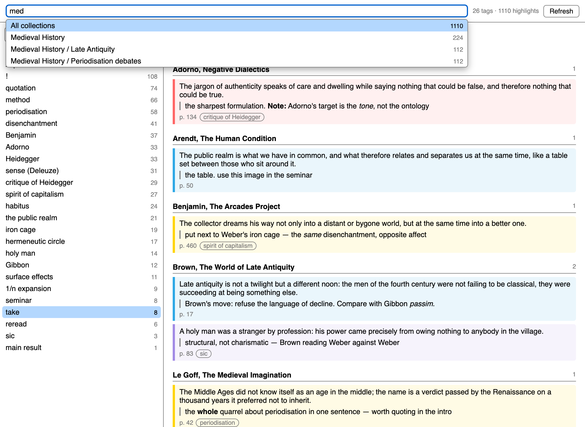
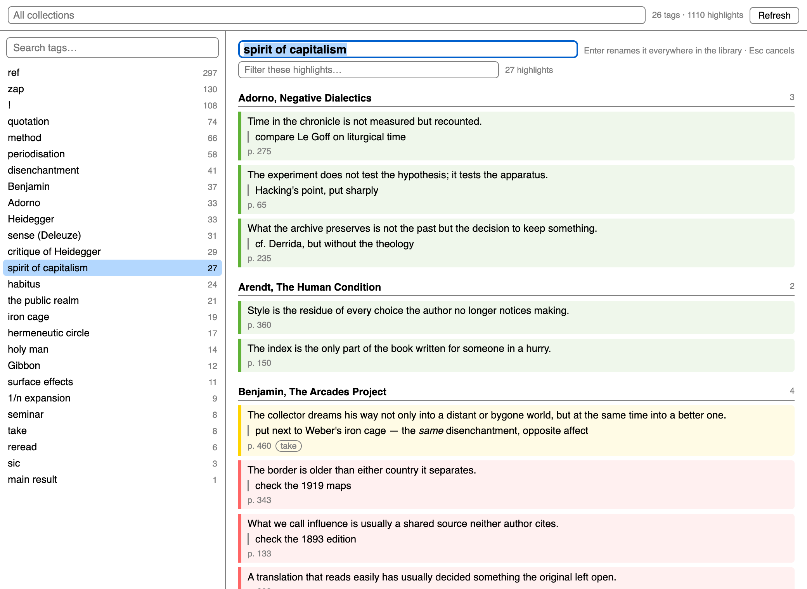
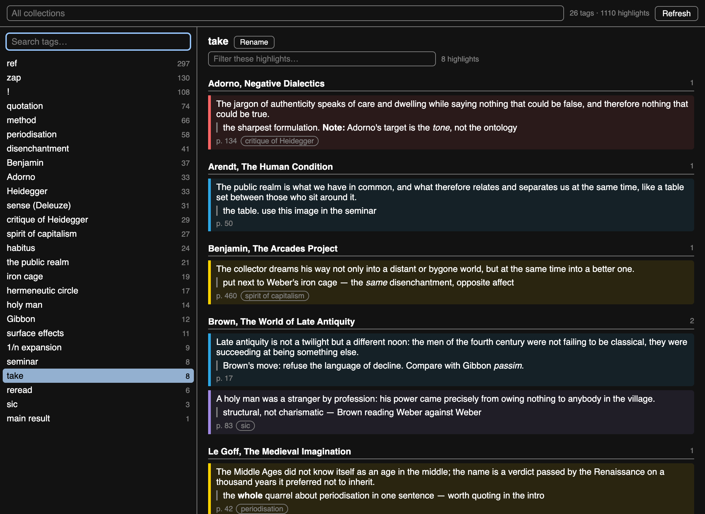

# Tag Explorer

A Zotero 10 plugin for reading your own marginalia by tag.

**Tools → Tag Explorer…** opens a window:

- every tag you have put on a highlight, most used first, with a fuzzy search
  box: your letters have to appear in the tag in order, but need not be
  adjacent, so `mdvl` finds `medieval` and `хдг` finds `Хайдеггер`. Matching
  is literal and case-insensitive. Exact matches sort above prefixes above
  substrings above scattered ones;
- the highlights carrying the selected tag on the right, grouped by book, in
  reading order, in their own highlight colour, with your comments — rendering
  the four formats Zotero itself writes, `<i>` `<b>` `` ``. Only
  those, in pairs: a highlight reading `< H ≤ 1` is maths, not markup, and
  stays as it is;
- a filter over the highlights of the selected tag — every word you type has to
  appear somewhere in the highlight, your comment or the book, in any order, so
  `decline brown` and `brown decline` both find the same one. `Esc` clears it;
  it resets whenever you pick a different tag;
- a collection box at the top to restrict everything to one project —
  fuzzy-searchable over the full path (`phil frank` finds *Philosophy /
  Frankfurt School*), showing how many highlights each holds,
  sub-collections included;
- **Rename** edits the tag in place and calls Zotero's own rename, so it moves every item
  in the library that carries it — not just these highlights, and not just the
  collection in scope — keeps the tag's colour and syncs;
- the other tags on a highlight are chips: click one to jump to it;
- click a highlight to open the reader on it.

Right-clicking a collection in the library offers **Explore Tags in This
Collection…**, which opens the same window already restricted.

`↓` `↑` `Enter` move through the tag list from the search box, and through
the collection list from the collection box. `Esc` closes.

## What it looks like

Fuzzy search over the tags — `crth` finds *critique of Heidegger*, because your
letters only have to appear in order:

Narrowing a tag down. `take` has hundreds of highlights; the filter looks in the
highlight, your comment and the book title at once:

Restricting everything to one collection, searched the same way over the full
path, with the number of highlights each one holds:

Renaming a tag in place. Enter hands it to Zotero's own rename, so every item in
the library that carries the tag moves with it:

It follows the system theme:

Screenshots show invented demo content, not a real library. They are of the
real interface: `bootstrap.js` is loaded verbatim and draws these pages itself.

## Install

Download `tag-explorer.xpi` from the
[latest release](https://github.com/ievlevpn/zotero-tag-explorer/releases/latest),
then Zotero → Tools → Plugins → ⚙ → *Install Plugin From File…*

## Hacking

No build step. The whole plugin is `bootstrap.js`.

	zip -r tag-explorer.xpi manifest.json bootstrap.js locale icons

and install that. `node test.js` checks the pure helpers; `./release.sh` cuts
a release (bump `version` in `manifest.json` first).

## How it works

Nothing is stored. Opening the window reads every tagged annotation in every
library into one array (one SQL query for the ids, the Zotero item API for
everything else, 500 items at a time) and each view is a scan over it. About ten thousand tagged
highlights load in a second or so and every keystroke after that is instant.
The index is built once per session — **Refresh** rebuilds it after you tag
something new.
